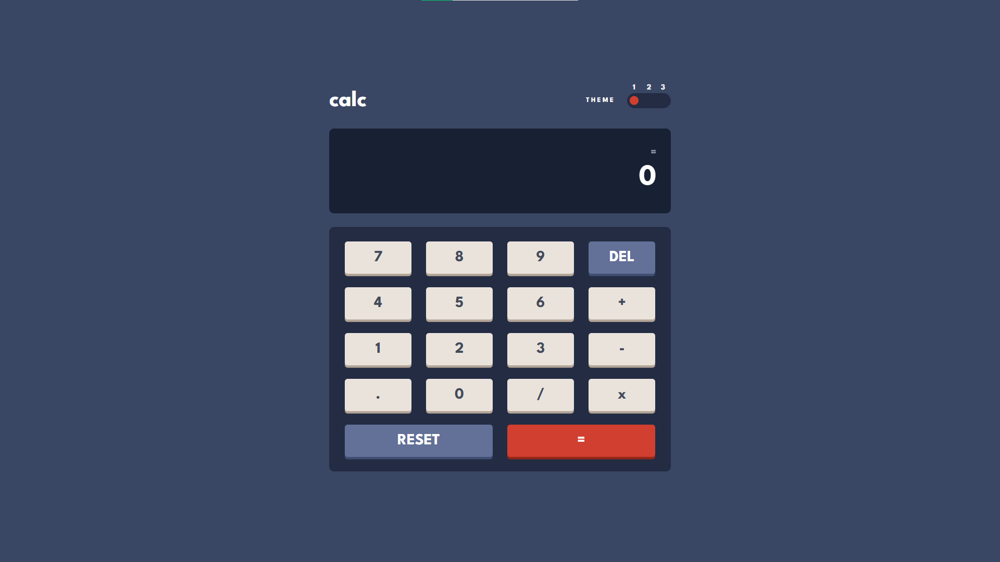

# Frontend Mentor - Calculator app solution

This is a solution to the [Calculator app challenge on Frontend Mentor](https://www.frontendmentor.io/challenges/calculator-app-9lteq5N29). Frontend Mentor challenges help you improve your coding skills by building realistic projects. 

## Table of contents

- [Overview](#overview)
  - [The challenge](#the-challenge)
  - [Screenshot](#screenshot)
  - [Links](#links)
- [My process](#my-process)
  - [Built with](#built-with)
  - [What I learned](#what-i-learned)
  - [Continued development](#continued-development)
- [Author](#author)


## Overview

### The challenge

Users should be able to:

- See the size of the elements adjust based on their device's screen size
- Perform mathmatical operations like addition, subtraction, multiplication, and division
- Adjust the color theme based on their preference
- **Bonus**: Have their initial theme preference checked using `prefers-color-scheme` and have any additional changes saved in the browser

### Screenshot




### Links

- Solution URL: [Solution URL](https://www.frontendmentor.io/solutions/calculator-app-solution-html-css-js-yLtBLDBvJg)
- Live Site URL: [Live site](https://mohamadbiomy.github.io/calculator-app)

## My process

### Built with

- HTML5
- CSS3
- Flexbox
- CSS Grid
- MediaQueries
- Vanilla JavaScript


### What I learned


- I leart more about changing themes and (prefers-color-scheme) CSS media property.

```css
@media (prefers-color-scheme: light) {
  :root {
  /* backgrounds */
  --main-background: #e6e6e6;
  --toggle-background: #d1cccc;
  --keypad-background: #d1cccc;
  --screen-background: #ededed;
  
  /* keys */
  --key-background: #378187;
  --key-background-hover: #62b5bd;
  --key-shadow: #1b6066;
  
  --key-background-toggle: #c85402;
  --key-background-toggle-hover: #ff8b38;
  --key-shadow-toggle: #873901;
  
  --key-background-light: #e5e4e1;
  --key-background-light-hover: #ffffff;
  --key-shadow-light: #a69d91;
  
  /* text */
  --main-text: #36362c;
  --header-text: #36362c;
  --second-text: #ffffff;
  --equal-text: #ffffff;
  }
}
```

- I think the most tiring thing in this app is assuming all different actions the user could take, so calc() function and 
calculating mechanism is the code I am proud of it the most.

```js
function calc(operator, val1, val2) {
  let result;
  val1 = parseFloat(val1)
  val2 = parseFloat(val2)
  switch (operator) {
    case "+":
      result = val1 + val2
      break;
    case "-":
      result = val1 - val2
      break;
    case "x":
      result = val1 * val2
      break;
    case "/": 
      result = val1 / val2
      break;
  }

  if (result === 0) return result
  if (result === Infinity || result === -Infinity) return undefined

  return result || undefined

}
```


### Continued development

I will continue developing my logical thinking and my problem solving skills, 
becuase I think I could have done the calculating operations better.


## Author

- Frontend Mentor - [@MohamadBiomy](https://www.frontendmentor.io/profile/MohamadBiomy)

